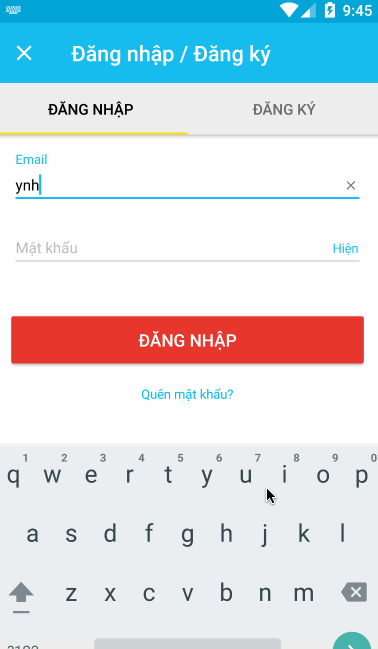

# AutoCompleteEmail

[](https://travis-ci.org/tikivn/AutoCompleteEmail)

EditTextView suggests pre-define email domains.



##Gradle Usage

Step 1. Add the dependency

Add it in your root build.gradle at the end of repositories:

```
dependencies {
        compile 'vn.tiki.widgets:autocompleteemail:1.0.1'
}
```

##Usage
In your folder ``values`` create ``arrays.xml``

```
<resources>
  <string-array name="domains">
    <item>gmail.com</item>
    <item>yahoo.com</item>
    <item>tiki.vn</item>
    <item>hotmail.com</item>
    <item>co.jp</item>
  </string-array>
</resources>
```

In your layout XML

```
 <vn.tiki.widgets.AutoCompleteEmailEditText
              android:id="@+id/etEmail"
              android:layout_width="match_parent"
              android:layout_height="wrap_content"
              android:inputType="textEmailAddress"
              app:domains="@array/domains"/>
```

Or set domains in Java

```
   List<String> domains = Arrays.asList("gmail.com", "yahoo.com");
   emailView.setSuggestedDomains(domains);
```


## License

    Copyright 2016 Tiki Corp

    Licensed under the Apache License, Version 2.0 (the "License");
    you may not use this file except in compliance with the License.
    You may obtain a copy of the License at

       http://www.apache.org/licenses/LICENSE-2.0

    Unless required by applicable law or agreed to in writing, software
    distributed under the License is distributed on an "AS IS" BASIS,
    WITHOUT WARRANTIES OR CONDITIONS OF ANY KIND, either express or implied.
    See the License for the specific language governing permissions and
    limitations under the License.

